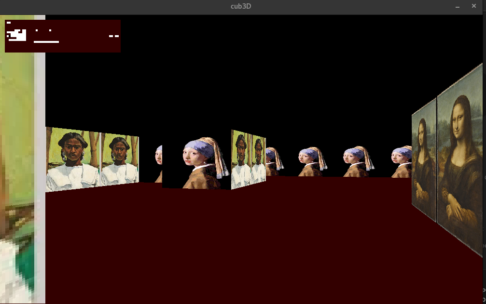
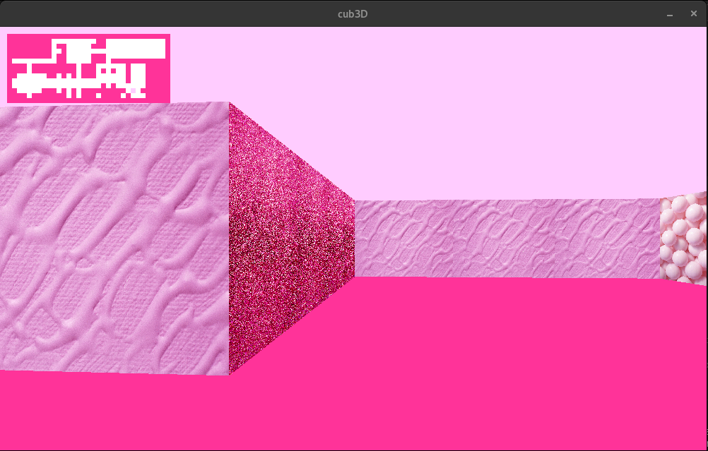
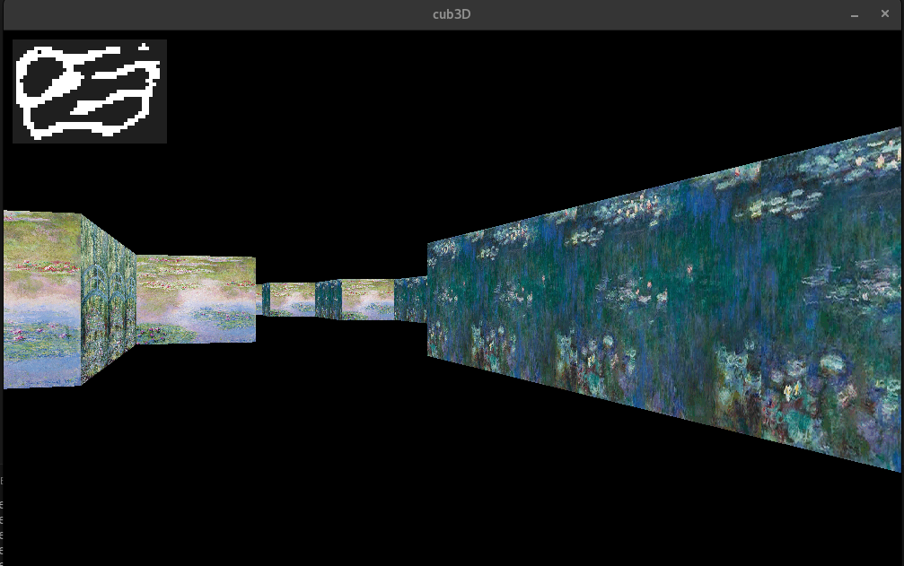

# cub3d - Raycasting Game Engine

Projet graphique de l'École 42 implémentant un moteur de rendu 3D basé sur le raycasting, inspiré du légendaire Wolfenstein 3D.

## 🚀 Lancement rapide avec Docker

### Prérequis
- Docker installé sur votre système

### Instructions
1. **Cloner le projet**
   ```bash
   git clone https://github.com/ZenabaNouriatte/cub3d.git
   cd cub3d
   ```

2. **Construire l'image Docker**
   ```bash
   docker build -f docker/Dockerfile -t cub3d-container .
   ```

3. **Lancer le conteneur**
   ```bash
   docker run -it -p 8080:8080 cub3d-container
   ```

4. **Accéder à l'interface**
   - Ouvrir votre navigateur sur : http://localhost:8080/vnc.html
   - Entrer le mot de passe : `cub3dpass`

### ⚠️ Limitation importante
Vous pourrez voir le rendu visuel du jeu mais **les contrôles ne fonctionneront pas**. Ceci est dû au fait que les événements clavier/souris ne sont pas correctement transmis à travers l'interface VNC web. Pour une expérience de jeu complète, utilisez l'installation native Linux.

## 🎮 À propos du projet cub3d

cub3d est un moteur de rendu 3D utilisant la technique du **raycasting** pour créer l'illusion de la 3D dans un environnement 2D. Le joueur navigue dans un labyrinthe en vue subjective, avec des murs texturés et des sprites.

### Fonctionnalités
- Rendu 3D en temps réel par raycasting
- Textures murales différentes selon l'orientation
- Gestion des collisions
- Contrôles fluides (déplacement WASD, rotation souris/flèches)
- Parsing de cartes personnalisées
- Sprites et éléments décoratifs

### Lancement natif sur Linux

**Prérequis :**
- Système Linux
- GCC et Make installés
- Librairies X11 et OpenGL

**Instructions :**
```bash
# Compiler le projet
make

# Lancer le jeu avec une carte
./cub3D maps/good_map/[nom_de_carte].cub
```

**Cartes disponibles :**
Consultez le dossier `maps/good_map/` pour découvrir les différentes cartes jouables.

**Contrôles :**
- `W A S D` : Déplacement
- `←→` ou souris : Rotation de la caméra
- `ESC` : Quitter le jeu

## 🐳 Pourquoi la containerisation ?

### Problématique
Le projet cub3d utilise la **MiniLibX**, une librairie graphique spécifique à l'École 42 qui :
- N'est disponible que sur certains systèmes Linux
- A des dépendances système très spécifiques
- Peut être difficile à installer sur différents environnements

### Solution Docker
La containerisation permet de :
- **Isoler l'environnement** : Toutes les dépendances sont pré-installées
- **Garantir la portabilité** : Fonctionne sur n'importe quel système avec Docker
- **Simplifier le déploiement** : Un seul build, utilisable partout
- **Éviter les conflits** : Aucune modification du système hôte nécessaire

### Architecture du conteneur
- **Base** : Ubuntu avec environnement graphique léger
- **VNC Server** : Pour l'accès distant à l'interface graphique
- **Interface Web** : noVNC pour l'accès via navigateur
- **Dépendances** : MiniLibX, X11, et tous les outils de développement

## 📁 Structure du projet

```
cub3d/
├── docker/
│   └── Dockerfile          # Configuration du conteneur
├── maps/
│   └── good_map/          # Cartes de jeu valides
├── src/                   # Code source
├── includes/              # Headers
├── Makefile              # Compilation
└── README.md             # Ce fichier
```

## 🛠️ Technologies utilisées

- **Langage** : C
- **Librairie graphique** : MiniLibX (École 42)
- **Algorithme** : Raycasting
- **Containerisation** : Docker + VNC + noVNC
- **Environnement** : Linux/Ubuntu

## 🔍 Aperçu visuel

### Rendu map "museum.cub"


### Map "bubble_gum.cub"


### Map "nympheas.cub"

---

*Projet réalisé dans le cadre du cursus de l'École 42*
